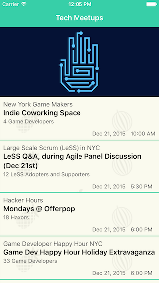
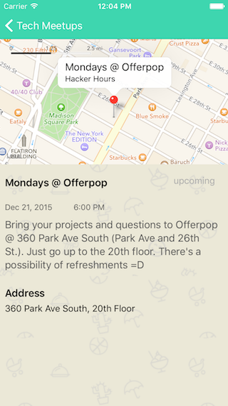

#MeetupDemo

A demo application that implements Meetup open events API.  

## Instructions
- Get an API key from http://www.meetup.com/meetup_api/
- Paste the key into the file named MeetupsViewController.swift, next to APIKey 

:)
